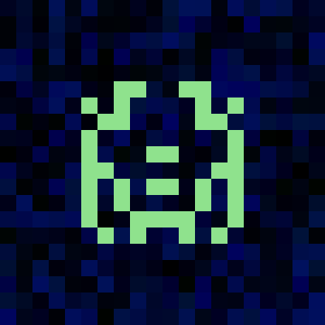

# Space Invader NFT Marketplace

TP3 - IFT-4100/7100 Concepts et applications de la blockchain

A decentralized NFT marketplace built on Ethereum (Sepolia testnet). Space Invader images are procedurally generated in Python and minted as ERC-721 tokens with royalty support. The marketplace allows fixed-price listings, purchases, and an offer system.

<p align="center">
  
  
  
  
  
</p>

---

## Architecture

| Component | Technology | Notes |
|---|---|---|
| Smart contracts | Solidity 0.8.28 + OpenZeppelin v5 | NFT (V1->V2) + Marketplace (V1->V2) via UUPS proxy |
| Development framework | Hardhat v2 + TypeScript | Tests with Mocha/Chai |
| NFT standard | ERC-721 + ERC-2981 (royalties) | `SpaceInvaderNFT.sol` |
| Marketplace | Fixed-price sales + offer system | `SpaceMarketplaceV1.sol` -> `SpaceMarketplaceV2.sol` |
| Storage | IPFS via Pinata | Images + metadata JSON |
| Frontend | React + Vite + wagmi v2 + viem | MetaMask / WalletConnect |
| Testnet | Ethereum Sepolia | chainId 11155111 |

### Payment flow (buyNFT)

```
Buyer (1 ETH)
  -> 5%    -> Creator (ERC-2981 royalty)
  -> 2.5%  -> Platform (fee recipient)
  -> 92.5% -> Seller
```

### Deployment model

```
SpaceInvaderNFT    -> UUPS proxy (v1) + upgrade to v2 (SpaceInvaderNFTV2)
SpaceMarketplace   -> UUPS proxy (v1) + upgrade to v2 (SpaceMarketplaceV2)
```

---

> **Node.js version**: Use Node.js **v22 LTS**. Node v25+ is incompatible with Hardhat and will produce a `MODULE_NOT_FOUND` error. Use `nvm use 22` or check `.nvmrc`.

## Prerequisites

- Node.js **v22 LTS** (v18+ minimum - v25 breaks Hardhat)
- Python 3.10+
- MetaMask with Sepolia ETH ([faucet](https://sepoliafaucet.com) or [Alchemy](https://www.alchemy.com/faucets/ethereum-sepolia))
- Pinata account (free tier) for IPFS uploads
- (Optional) Alchemy / Infura RPC URL for Sepolia

---

## Installation

```bash
git clone https://github.com/alexandreeberhardt/Space-NFT-Marketplace
cd Space-NFT-Marketplace

# Copy and fill in secrets
cp .env.example .env

# Install JS/TS dependencies
npm install

# Install Python dependencies
pip install -r requirements.txt
```

### .env variables

| Key | Description |
|---|---|
| `PRIVATE_KEY` | Deployer private key (no 0x prefix needed) |
| `SEPOLIA_RPC_URL` | Alchemy/Infura Sepolia RPC URL |
| `PINATA_JWT` | Pinata API JWT token |
| `ETHERSCAN_API_KEY` | For contract verification (optional) |

---

## Compile

```bash
npx hardhat compile
# Copy ABIs to frontend after compiling:
npx hardhat run scripts/copyAbis.ts
```

---

## Test

```bash
npx hardhat test
```

Expected output: **19 tests passing** covering:
1. Contract deployment
2. NFT minting
3. NFT listing
4. NFT purchase
5. Royalties and fee distribution
6. Offer system (makeOffer / acceptOffer / withdrawOffer)
7. Multi-collection state isolation
8. Duplicate listing prevention
9. Incorrect ETH amount revert
10. Marketplace safety checks
11. **Upgrade SpaceMarketplace v1 -> v2** (state preservation + offer system)
12. **Upgrade SpaceInvaderNFT v1 -> v2** (state preservation + max-supply cap)

```bash
# With coverage (bonus):
npx hardhat coverage
```

---

## Generate NFT Assets

```bash
# Generate 20 Space Invader PNG images
python3 generate_invaders.py   # edit INVADER_COUNT = 20

# Extract attributes (seed, body color) for metadata
python3 scripts/extract_attributes.py

# Upload images + metadata to Pinata IPFS
npx hardhat run scripts/uploadToIPFS.ts
# Outputs: scripts/imageCIDs.json, scripts/tokenURIs.json
```

---

## Deploy

### Local (Hardhat node)

```bash
# Terminal 1: start local node
npx hardhat node

# Terminal 2: deploy
npx hardhat run scripts/deploy.ts --network localhost
npx hardhat run scripts/mintBatch.ts --network localhost
```

After deploying locally, update `frontend/src/contracts/addresses.ts` with the printed NFT proxy address and marketplace address (chainId 31337).

### Sepolia testnet

```bash
npx hardhat run scripts/deploy.ts --network sepolia
npx hardhat run scripts/mintBatch.ts --network sepolia
```

Addresses are saved to `deployments/sepolia.json`. Copy the NFT proxy address and marketplace address into `frontend/src/contracts/addresses.ts` under key `11155111`.

### Upgrade SpaceMarketplace v1 -> v2 (Sepolia)

```bash
npx hardhat run scripts/upgrade.ts --network sepolia
```

This upgrades the `SpaceMarketplace` UUPS proxy to `SpaceMarketplaceV2`, which adds the offer system (`makeOffer` / `acceptOffer` / `withdrawOffer`). All existing listings and platform configuration are preserved. The proxy address stays the same; only the implementation address changes.

---

## Frontend

```bash
cd frontend
cp .env.example .env
# Fill in VITE_SEPOLIA_RPC_URL and VITE_WALLETCONNECT_PROJECT_ID

npm install
npm run dev
# Opens at http://localhost:5173
```

Get a free WalletConnect project ID at [cloud.walletconnect.com](https://cloud.walletconnect.com).

```bash
# Production build:
npm run build
```

---

## Deployed Contracts (Sepolia)

| Contract | Proxy / Address | Implementation | Explorer |
|---|---|---|---|
| SpaceInvaderNFT (proxy) | `0x3a5d2721257a26DaBdD6A14b64C0634ffC8dCCD3` | `0x2e99f91DC50D704e3339ecdCC943821a54A33fA8` (V1) | [Etherscan](https://sepolia.etherscan.io/address/0x3a5d2721257a26DaBdD6A14b64C0634ffC8dCCD3) |
| SpaceMarketplace (proxy) | `0xAA5038Faf52ac76EebFaa8C3865D8110B6f9369B` | `0x022E69F1664aEAB6C991B81142E0BcD751039ce3` (V2) | [Etherscan](https://sepolia.etherscan.io/address/0xAA5038Faf52ac76EebFaa8C3865D8110B6f9369B) |

The NFT implementation and the marketplace contract are verified on Etherscan.

---

## Security Notes

- **CEI pattern** enforced in `buyNFT` and offer functions: state updated before any external call.
- **Reentrancy guard** implemented inline using a `uint256 _reentrancyStatus` storage variable (no OZ base contract needed with OZ v5).
- **ETH transfers** use `.call{value:}("")` - not `.transfer()` - to support smart contract wallets.
- **Custom errors** used throughout for gas efficiency.
- **Input validation** on all public entry points (`ZeroPrice`, `ZeroAddress`, `FeeTooHigh`).
- **Private key** never committed - use `.env` (gitignored).
- **SpaceMarketplace is upgradeable via UUPS**: V1 deployed as proxy, upgraded to V2 (adds offer system). `_authorizeUpgrade` gated by `onlyOwner`.
- **SpaceInvaderNFT UUPS upgrade** gated by `onlyOwner` via `_authorizeUpgrade`. V2 adds `setMaxSupply`.
- **Platform fee** capped at 10% (1000 bps) to prevent owner rug.

---

## Demo procedure

1. **Connect wallet** - open `http://localhost:5173` (or the deployed URL), click "Connect Wallet", select MetaMask on Sepolia testnet. The header shows your truncated address.

2. **Browse the gallery** - the Gallery tab fetches all minted tokens and displays active listings with image, price, and seller address.

3. **Buy an NFT** - click "Buy Now" on any listed card. MetaMask prompts a transaction for exactly the listed price. After 1 confirmation the card disappears from active listings.

4. **List an NFT you own** - go to "List NFT", enter a token ID you own, approve the marketplace (Step 1), then set a price and list (Step 2). Two transactions, each confirmed on-chain.

5. **Mint an NFT** - go to "Mint", paste an IPFS metadata URI (e.g. from `scripts/tokenURIs.json`), and confirm the transaction.

5b. **Place / accept / withdraw an offer** - go to "Offers". Use "Make Offer" to bid on any token, "Accept Offer" to accept a bid (approve first), or "Withdraw Offer" to reclaim your ETH.

6. **Proof of deployment** - the deployed contract addresses on Sepolia are linked in the "Deployed Contracts" section above. Both the NFT implementation and the marketplace are verified on Etherscan.

7. **Proof of v1 -> v2 upgrade** - after running `npx hardhat run scripts/upgrade.ts --network sepolia`, the proxy address stays the same but the implementation address changes. The new implementation is visible on Etherscan under the proxy's "Read as Proxy" tab. The `setMaxSupply` function becomes available, while all existing token state is intact.

---

## Project Structure

```
contracts/
  SpaceInvaderNFT.sol        ERC-721 + ERC-2981, UUPS (v1)
  SpaceInvaderNFTV2.sol      ERC-721 + ERC-2981, UUPS (v2 - adds setMaxSupply)
  SpaceMarketplaceV1.sol     Fixed-price marketplace, UUPS proxy (v1)
  SpaceMarketplaceV2.sol     Extends V1 with offer system (v2)
scripts/
  deploy.ts                  Deploy NFT proxy + marketplace V1 proxy
  upgrade.ts                 Upgrade SpaceMarketplace proxy v1 -> v2
  mintBatch.ts               Mint 20 NFTs on-chain
  uploadToIPFS.ts            Upload images + metadata to Pinata
  extract_attributes.py      Extract seed/color attributes
  copyAbis.ts                Copy ABIs to frontend
test/
  SpaceMarketplace.test.ts   18 automated tests (incl. upgrade v1->v2)
frontend/
  src/
    wagmi.config.ts          Chain + connector config
    contracts/               Addresses + ABIs
    components/              Gallery, NFTCard, ConnectButton, forms
    hooks/useNFTMarket.ts    wagmi read/write hooks
    utils/                   ipfsToHttp, formatError
generate_invaders.py         Procedural image generator
deployments/                 Deployed addresses (per network)
```
